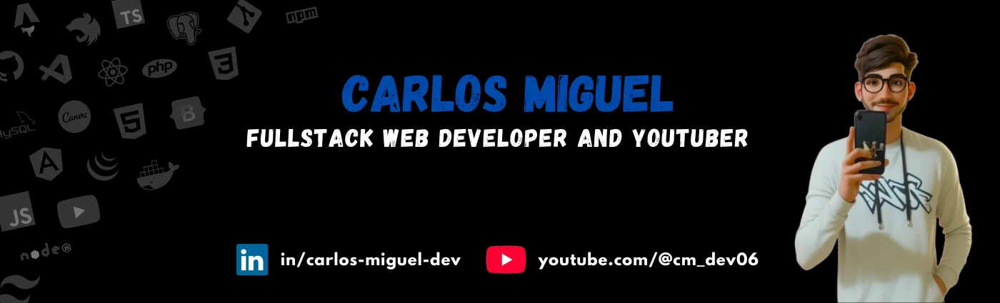
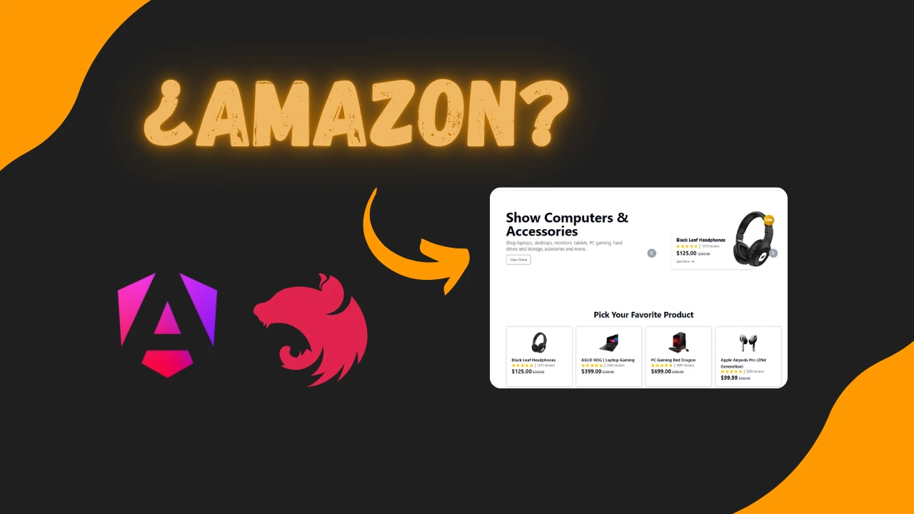
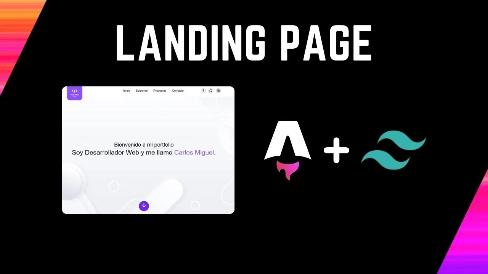
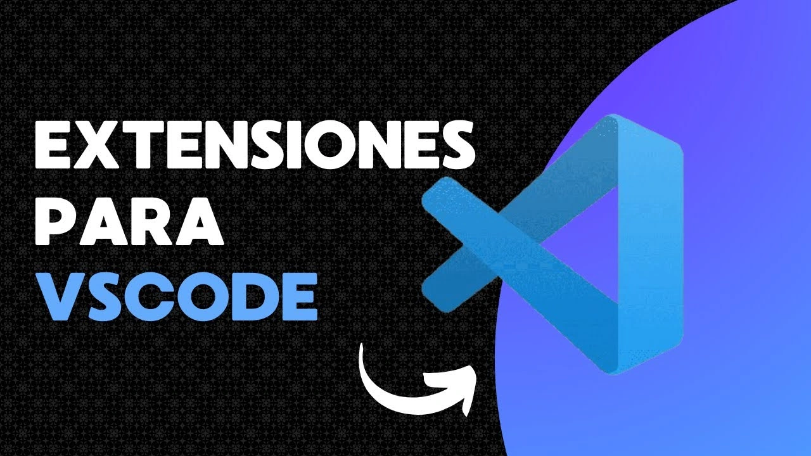
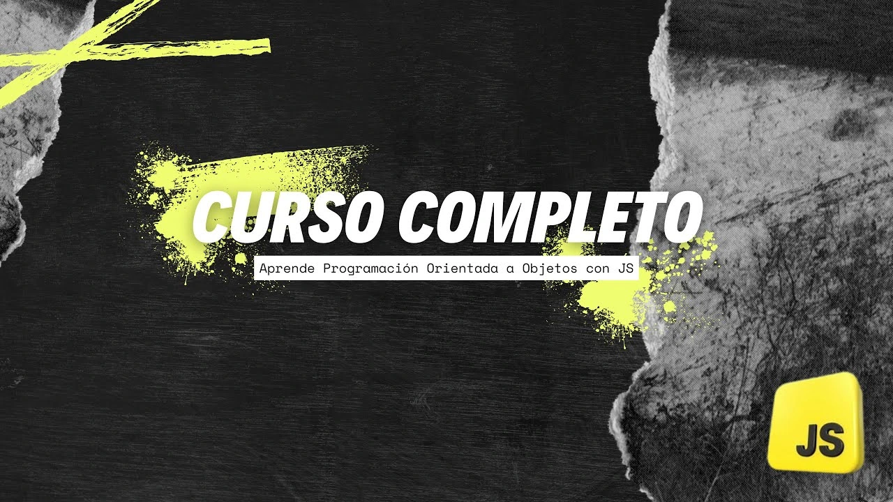

<h1 align="center">Bienvenido a mi perfil de GitHub 👋</h1>

Freelancer FullStack Web Developer y Youtuber Cubano 🇨🇺, me encanta **colaborar** en proyectos y **compartir** mis conocimientos con la comunidad. Mi objetivo es ayudar a otros a aprender de una forma más sencilla de lo que fue **para mí**.

Actualmente trabajo como **Freelancer** y en mi proyecto personal llamado **Theme Market**, un marketplace de sitios webs totalmente gratuito para que los desarrolladores puedan mejorar su productividad utilizando nuestras plantillas.

## Experiencia 🔭

-   Desarrollador Freelance: He trabajado en varios proyectos utilizando tecnologías como Angular, React, PHP, Docker, NestJS, entre otras.

## Proyectos Destacados 💼

<table style="width: 100%">
  <tr>
    <td>
      
    </td>
  </tr>
</table>

## Algunos de mis videos 📹

<table style="width: 100%">
  <tr>
    <td>
      
    </td>
    <td>
      
    </td>
    <td>
      
    </td>
    <td>
      
    </td>
  </tr>
</table>

## ¿Deseas Colaborar? 🤝

Todos los proyectos que estamos creando en **Theme Market** son totalmente **Open Source** por lo que siempre puedes **bifurcar** una plantilla, enviar una **pull request** y nosotros nos encargaremos de revisarla. Para ver todas las plantillas disponibles [haz click aquí](https://github.com/ThemeMarket?tab=repositories).

## Conéctate Conmigo

-   📫 Envíame un correo [carlosmiguel.dev06@gmail.com](mailto:carlosmiguel.dev06@gmail.com)
-   🔴 Sígueme en YouTube [@cm_dev06](https://www.youtube.com/@cm_dev06)
-   🔵 Conectemos en LinkedIn [in/carlos-miguel-dev](https://www.linkedin.com/in/carlos-miguel-dev)
-   🚀 Visita mi sitio web [https://carlos-miguel.vercel.app](https://carlos-miguel.vercel.app)
